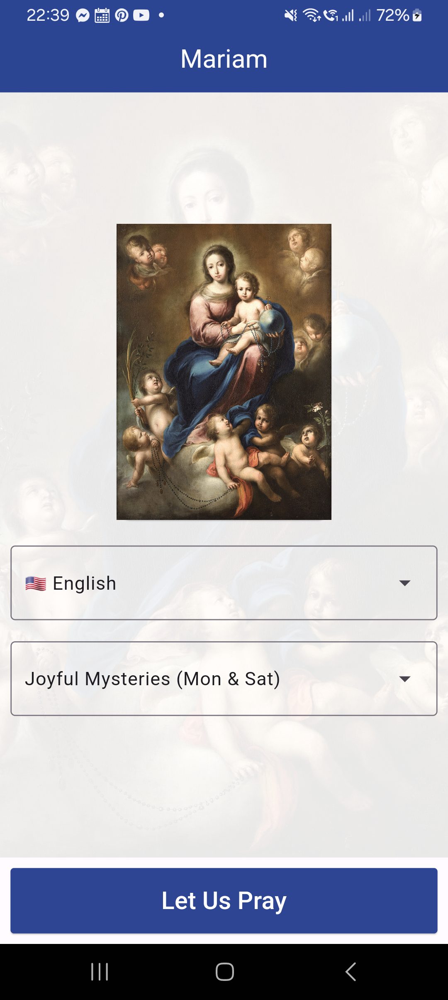

# Mariam

Download the latest APK from the [Releases Section](https://github.com/aldrinzigmundv/mariam/releases/latest)

## What is Mariam?

Mariam is a free, open-source rosary app that enables believers to pray the rosary even when they don't have a physical rosary at hand. It facilitates progress tracking and allows users to learn to pray the rosary in various languages, including Latin.

I chose the app name 'Mariam' as a nod to Mary, inspired by what is commonly believed to be her native tongue, Aramaic. This name adaptation aims to resonate with English speakers while paying homage to its origins in the language likely spoken by Mary.

I dedicate this app, 'Mariam,' to Our Lady of Fatima in honor of the miracles attributed to her that challenge disbelief. The profound impact of her reported miracles serves as an inspiration behind the creation of this app, which aims to facilitate devotion and prayer, carrying on the spirit of faith and reverence associated with Our Lady.

## Features
* Free and open-source, no tracking or ads
* Intuitive and easy-to-navigate interface design
* Currently supports 4 languages (English, Latin, Spanish and Filipino)

## How to Contribute

We welcome contributions from the community to improve translations for Mariam. If you would like to contribute by translating the app into additional languages or enhancing existing translations, please check the 'Translations' section in the repository to identify areas that require translation or improvement.

**This app is powered by aldrinzigmund.com**